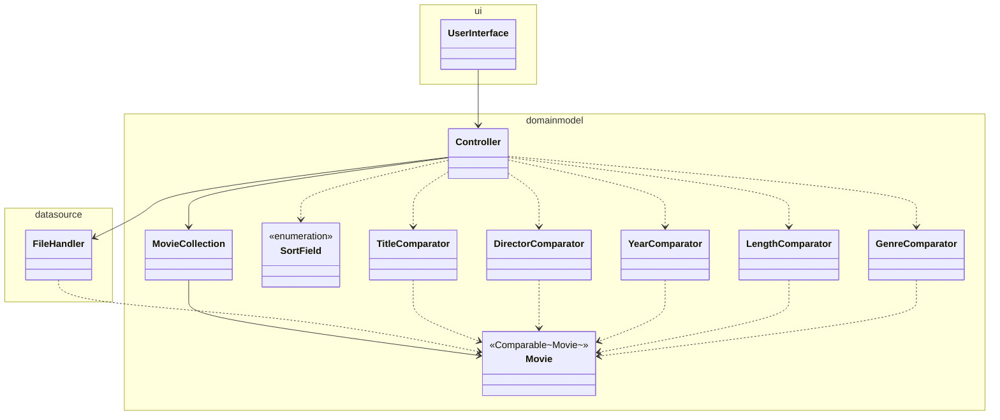

# Klassediagram – Filmsamling

# Klassediagram – Filmsamling

```mermaid
classDiagram
    namespace ui {
        class UserInterface
    }

    namespace domainmodel {
        class Controller
        class MovieCollection
        class Movie
        class SortField
        class TitleComparator
        class DirectorComparator
        class YearComparator
        class LengthComparator
        class GenreComparator
    }

    namespace datasource {
        class FileHandler
    }

    class SortField {
        <<enumeration>>
    }

    class Movie {
        <<Comparable~Movie~>>
    }

    UserInterface --> Controller
    Controller --> MovieCollection
    MovieCollection --> Movie
    Controller --> FileHandler
    FileHandler ..> Movie

    Controller ..> SortField
    Controller ..> TitleComparator
    Controller ..> DirectorComparator
    Controller ..> YearComparator
    Controller ..> LengthComparator
    Controller ..> GenreComparator

    TitleComparator ..> Movie
    DirectorComparator ..> Movie
    YearComparator ..> Movie
    LengthComparator ..> Movie
    GenreComparator ..> Movie
```
